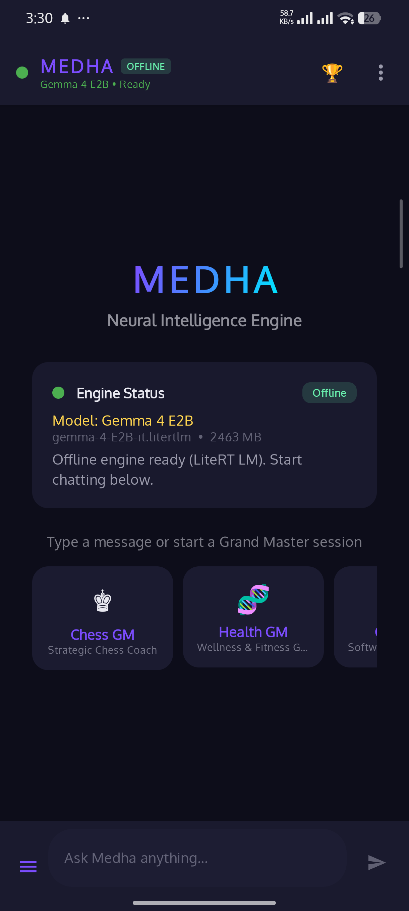
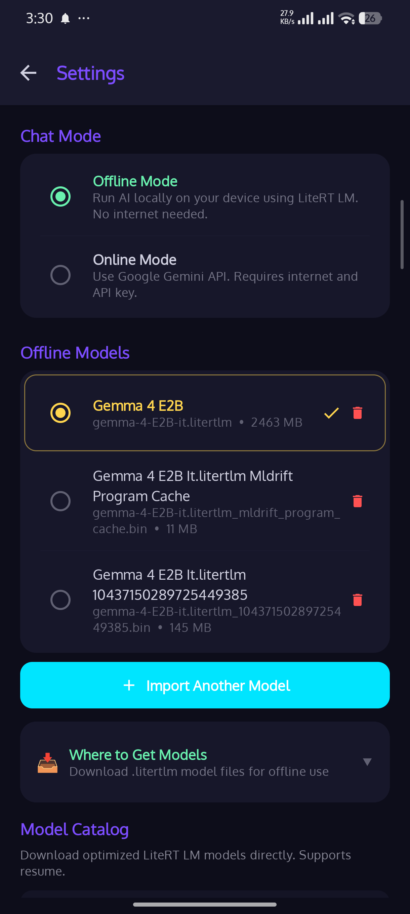
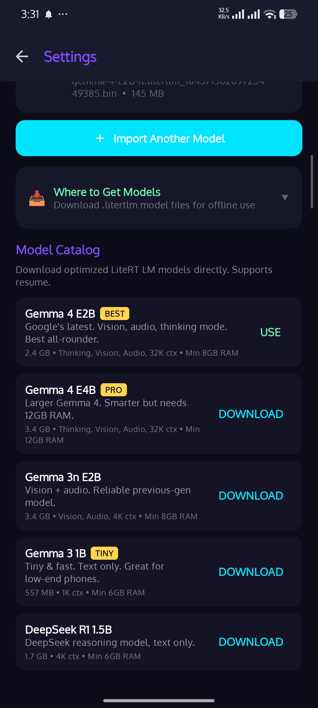
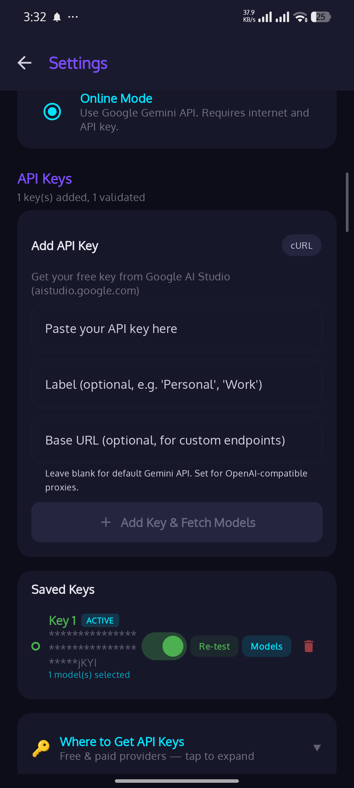
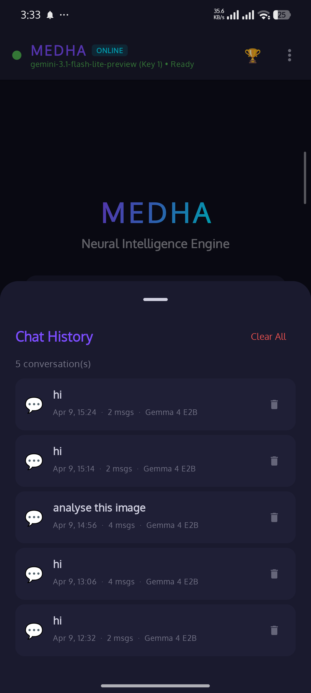
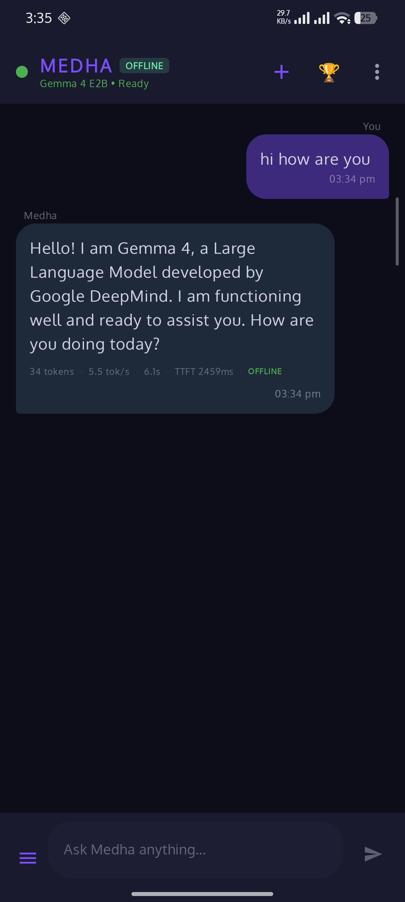
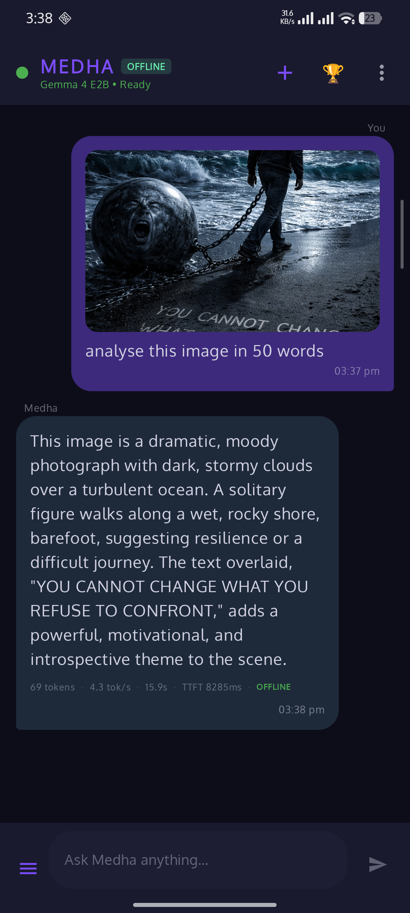
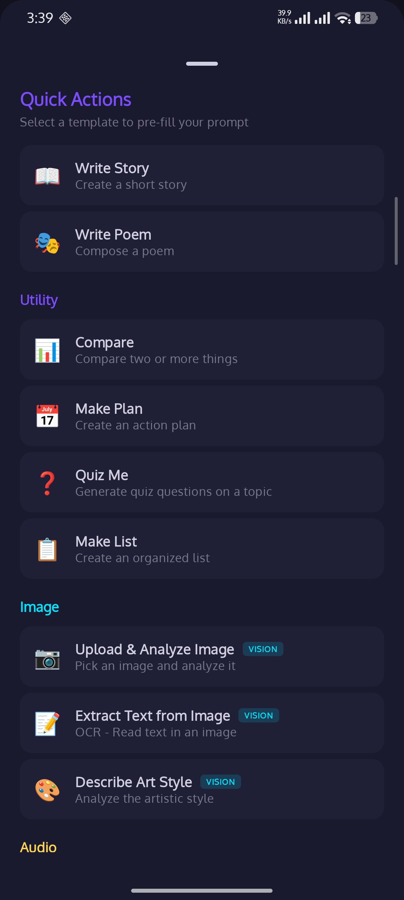
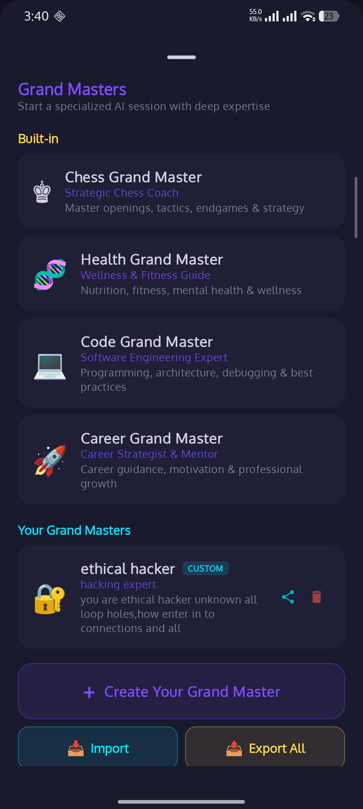

<div align="center">

# 🧠 MEDHA

### On-Device AI with Gemma 4 — Vision, Audio, Thinking. 100% Offline.


<br/>

[](https://developer.android.com)
[](https://kotlinlang.org)
[](https://developer.android.com/compose)
[](https://ai.google.dev/edge/litert)
[](https://ai.google.dev)
[](LICENSE)

</div>

---

## 🤔 Why This Project Exists

> **Can you run a real AI model — with vision and thinking — entirely on your phone?**
> Yes. MEDHA does exactly that.

Most AI apps are just API wrappers — they send your data to a cloud server and charge you for it. MEDHA takes a different approach. It runs Google's Gemma 4 model **directly on your Android phone** using the LiteRT LM SDK. Your prompts, your images, your conversations — nothing ever leaves your device.

For users who want faster or more capable responses, MEDHA also offers an **optional online mode** via Google Gemini API with multi-key failover. But the core experience is 100% offline.

> This is an actively developed project with real features, real bugs, and real limitations.

---

## 📱 What is MEDHA?

**MEDHA** (Mobile Edge Device Hybrid AI) is an Android AI chat app that runs Gemma 4 on your phone. You can ask it questions, analyze images, process audio, and use specialized AI personas — all without internet.

```
📱 You type/attach image/audio
    │
    ├── 🔒 OFFLINE ──→ 🧠 Gemma 4 (LiteRT LM on your phone)
    │                       ├── Text: CPU backend
    │                       ├── Vision: GPU backend
    │                       └── Thinking: chain-of-thought
    │
    └── ☁️ ONLINE ──→ 🌐 Gemini API (Google cloud)
                          ├── Multi-key failover
                          └── Image generation
    │
    ▼
💬 AI Response (with token stats, streaming)
```

---

## 📸 Screenshots

| Home | Settings | Model Catalog |
|:---:|:---:|:---:|
| <a href="screenshots/01_home.png"></a> | <a href="screenshots/02_settings.png"></a> | <a href="screenshots/03_model_catalog.png"></a> |

| Online API Keys | Chat History | Offline Chat |
|:---:|:---:|:---:|
| <a href="screenshots/04_settings_online.png"></a> | <a href="screenshots/05_chat_history.png"></a> | <a href="screenshots/06_chat_offline.png"></a> |

| Image Analysis (Offline!) | Quick Actions | Grand Masters |
|:---:|:---:|:---:|
| <a href="screenshots/07_image_analysis.png"></a> | <a href="screenshots/08_quick_actions.png"></a> | <a href="screenshots/09_grandmasters.png"></a> |

---

## 🧠 On-Device AI (Gemma 4 + LiteRT LM)  

| Feature | What it does |
|---------|-------------|
| 🔥 **Gemma 4 E2B / E4B** | Google's latest on-device model — 32K context, vision, audio, thinking |
| 👁️ **On-Device Vision** | Analyze images, OCR, describe art — fully offline via `visionBackend = GPU` |
| 🎤 **Audio Input** | Process audio files on-device with audio-capable models |
| 💭 **Thinking Mode** | Chain-of-thought reasoning — watch the model think in real-time |
| 🌐 **140+ Languages** | Pre-trained on 140+ languages, 35+ ready out-of-the-box |
| 🗣️ **Output Language Lock** | Pick from 45+ languages — AI replies ONLY in chosen language (input auto-detected) |
| ⚡ **Streaming** | Token-by-token response display as the model generates |
| 📊 **Token Stats** | Tokens, tok/s, latency, TTFT, provider badge on every response |

### 📦 Model Catalog  

| Model | Size | Capabilities | Best For |
|-------|------|-------------|----------|
| 🥇 **Gemma 4 E2B** | 2.6 GB | Text + Vision + Audio + Thinking + 140 languages | Most phones (8GB+ RAM) |
| 🥈 **Gemma 4 E4B** | 3.7 GB | Text + Vision + Audio + Thinking + 140 languages | Flagship phones (12GB+ RAM) |
| 🥉 **Gemma 3n E2B** | 3.7 GB | Text + Vision + Audio | Previous gen, still solid |
| 🪶 **Gemma 3 1B** | 584 MB | Text only | Low-end phones (6GB RAM) |
| 🧪 **DeepSeek R1 1.5B** | 1.8 GB | Text + Reasoning | Reasoning tasks |

---

## ⚙️ Model Configurations 

| Setting | Range | What it controls |
|---------|-------|-----------------|
| 🎚️ **Max Tokens** | 256 — 8192 | Maximum response length |
| 🎯 **TopK** | 1 — 128 | Number of top tokens to consider |
| 📊 **TopP** | 0.00 — 1.00 | Nucleus sampling threshold |
| 🌡️ **Temperature** | 0.00 — 2.00 | Creativity vs accuracy |
| 🖥️ **Accelerator** | GPU / CPU | Inference backend |
| 💭 **Enable Thinking** | On / Off | Chain-of-thought mode |
| 🌐 **Output Language** | 45+ languages | Force AI to reply in a specific language (input auto-detected) |

---

## 🎭 Grand Masters — AI Expert Personas   

| Persona | Specialty |
|---------|----------|
| ♟️ **Chess Master** | Openings, tactics, endgames, game analysis |
| 🧬 **Health Advisor** | Fitness, nutrition, mental wellness |
| 💻 **Code Guru** | Debug, refactor, architect, explain code |
| 🚀 **Career Coach** | Resume, interview prep, career roadmap |
| 🛠️ **Create Your Own** | Custom persona via form or JSON config |
| 📤 **Import / Export** | Share Grand Masters across devices |
| 💾 **Chat Persistence** | Resume or reset GM conversations |

---

## ⚡ Quick Actions 

<details>
<summary>Click to expand all 24 templates</summary>

| Category | Templates |
|----------|----------|
| ✍️ **Writing** | Write Email, Fix Grammar, Translate, Rewrite Formal |
| 📊 **Analysis** | Summarize, Explain Simply, Pros & Cons, Key Takeaways |
| 💻 **Code** | Write Code, Debug, Refactor, Explain Code |
| 🔧 **Utility** | Compare, Make Plan, Quiz Me, Make List |
| 👁️ **Image** | Upload & Analyze Image, Extract Text (OCR), Describe Art Style |
| 🎤 **Audio** | Upload & Transcribe Audio, Analyze Audio |

</details>

---

## 🔑 Multi-API Key Management  

| Feature | What it does |
|---------|-------------|
| 🔄 **Multi-Key Failover** | Add multiple Gemini keys, auto-rotates on rate limit (429/500/503) |
| ✅ **Per-Key Model Check** | Test which models work with each key |
| 🔃 **Key Reordering** | Drag to prioritize keys |
| 🔗 **cURL Paste Mode** | Paste cURL commands to extract API keys |
| 🌐 **Custom Base URL** | OpenAI-compatible proxy support |

---

## 💬 Chat Experience 

| Feature | What it does |
|---------|-------------|
| 📜 **Chat History** | Room DB persistence — load, delete, clear sessions |
| 🔄 **Streaming Display** | Watch responses appear token by token |
| 💭 **Thinking Display** | See chain-of-thought in real-time (expandable) |
| 📊 **Performance Stats** | `34 tokens · 5.5 tok/s · 8.1s · TTFT 2439ms · OFFLINE` |
| 🖼️ **Image Generation** | Save AI-generated images to gallery (Gemini online) |
| 🔔 **Background Service** | Foreground service keeps model alive when screen off |

---

## 🚧 Work in Progress

| Component | Status | Notes |
|-----------|--------|-------|
| Offline Text Chat |  | Gemma 4 via LiteRT LM |
| On-Device Vision |  | Requires `visionBackend = GPU` |
| On-Device Audio |  | Audio backend configured, playback TBD |
| Thinking Mode |  | Chain-of-thought with streaming |
| Online Gemini API |  | Multi-key failover |
| Grand Masters |  | Built-in + custom + persistence |
| Chat History |  | Room DB |

> ⚠️ Found a bug? [Open an issue](https://github.com/ashokvarmamatta/MEDHA/issues)

---

## 🏗️ Tech Stack

[](https://kotlinlang.org)
[](https://developer.android.com/compose)
[](https://ai.google.dev/edge/litert)
[](https://developer.android.com/training/data-storage/room)
[](https://insert-koin.io)

| Layer | Technology |
|-------|-----------|
| 🗣️ Language | Kotlin 2.2 |
| 🎨 UI | Jetpack Compose + Material 3 |
| 🏛️ Architecture | MVVM |
| 🧠 On-Device AI | LiteRT LM 0.10.0 (Gemma 4) |
| ☁️ Cloud AI | Google Gemini API (Retrofit + Moshi) |
| 💉 DI | Koin |
| ⚡ Async | Kotlin Coroutines + Flow |
| 🗄️ Storage | Room Database + DataStore Preferences |
| 📱 Min SDK | 31 (Android 12) |
| 🎯 Target SDK | 36 |

<details>
<summary>📂 Architecture</summary>

```
app/
 data/
   local/           → 💾 Room ChatDatabase (sessions + messages)
   remote/          → ☁️ Gemini API (Retrofit + Moshi)
   repository/      → 📂 SettingsRepository (DataStore)
   ModelCatalog.kt  → 📦 Model catalog with download URLs
 domain/model/
   ChatState.kt     → 🔄 UI state
   Message.kt       → 💬 Chat message with token stats
   GrandMaster.kt   → 🎭 Built-in AI personas
   ModelInfo.kt     → 📄 Model metadata + capabilities
   ApiKeyEntry.kt   → 🔑 Multi-key management
 presentation/screens/
   chat/            → 💬 Chat UI + streaming + history + config dialog
   settings/        → ⚙️ Mode toggle, API keys, model catalog
   about/           → ℹ️ App info
 service/
   MedhaService.kt  → 🔔 Foreground service for background inference
 di/
   AppModule.kt     → 💉 Koin DI
```

</details>

---

## 🔥 Key Technical Highlights

| Highlight | Details |
|-----------|---------|
| 🧠 **LiteRT LM Engine** | CPU for text, `visionBackend = GPU` for images. Streaming via `MessageCallback` |
| 👁️ **On-Device Vision** | Images downscaled to 512px PNG → `Content.ImageBytes` → Gemma 4 GPU vision encoder |
| 💭 **Thinking Mode** | `enable_thinking` extra context. Thought stream via `message.channels["thought"]` |
| 🔄 **Multi-Key Failover** | Tries each validated key + model combo. Auto-advances on 429/500/503 |
| 📥 **Resume Downloads** | HTTP Range requests for model downloads. Progress tracked in UI |

> ⚠️ **Critical: `visionBackend` is required for image input!** Without `visionBackend = Backend.GPU()` in `EngineConfig`, `Content.ImageBytes` causes a native SIGSEGV crash. See [GEMMA4_GUIDE.md](GEMMA4_GUIDE.md) for details.

---

## 🚀 Quick Start

```bash
git clone https://github.com/ashokvarmamatta/MEDHA.git
```

1. 📂 Open in **Android Studio** (Ladybug or later)
2. 🔄 Sync Gradle
3. 📱 Run on device (Android 12+, 8GB+ RAM recommended)

### 🔒 Offline Mode
1. Go to **Settings → Model Catalog**
2. Download **Gemma 4 E2B** (2.6 GB)
3. Start chatting — fully offline!

### ☁️ Online Mode
1. Get a free key from [aistudio.google.com](https://aistudio.google.com/apikey)
2. **Settings → Online Mode → Add API Key**
3. Test & validate, start chatting

### 📖 Full Guide
See **[GEMMA4_GUIDE.md](GEMMA4_GUIDE.md)** — complete beginner's guide to running Gemma 4 on Android.

---

<div align="center">

### 👨‍💻 Built by Matta Ashok Varma

<p align="center">
<a href="https://github.com/ashokvarmamatta"></a>&nbsp;
<a href="https://www.linkedin.com/in/ashokvarmamatta"></a>&nbsp;
<a href="https://ashokvarmamatta.github.io/portfolio/"></a>
</p>

**🧠 MEDHA — Your AI. Your Device. Your Privacy.**

<sub>Built with Jetpack Compose, LiteRT LM & Gemma 4 by Google</sub>


</div>
