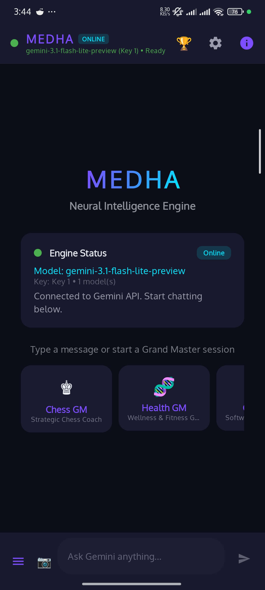
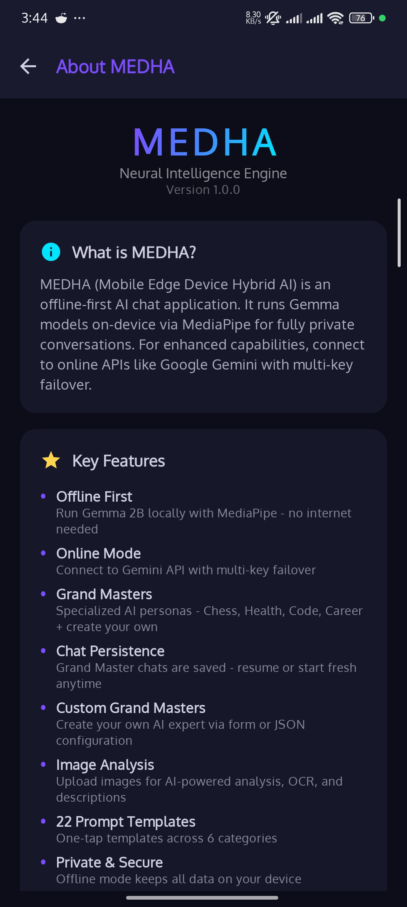
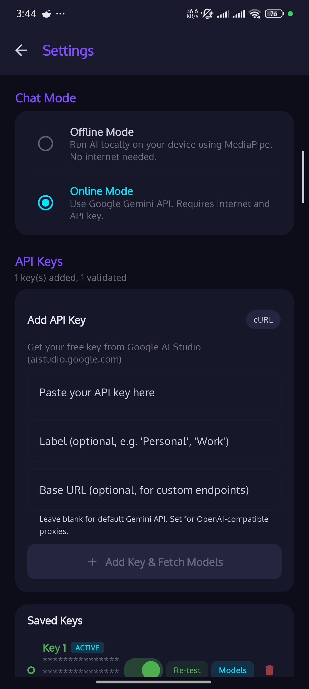
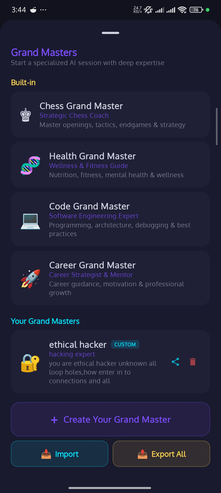
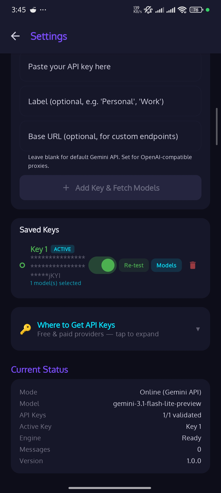
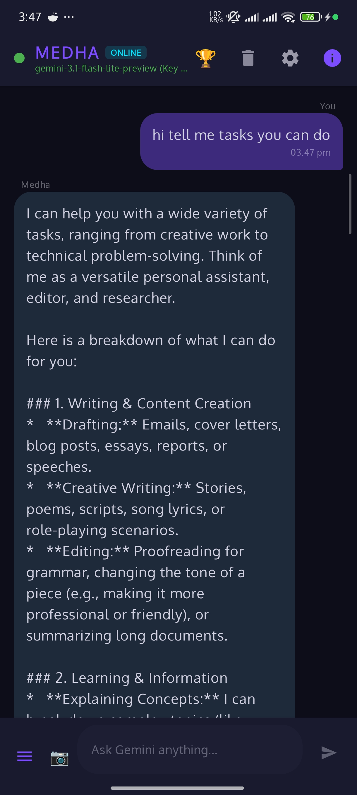
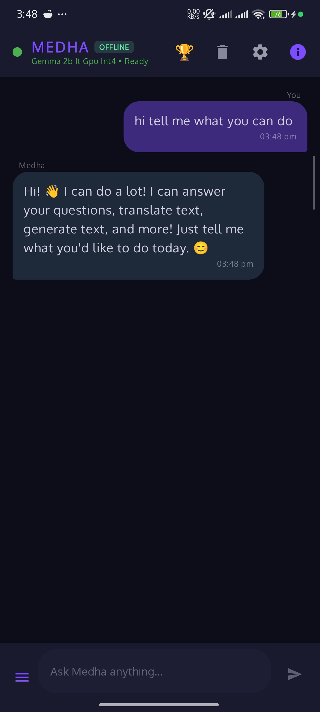
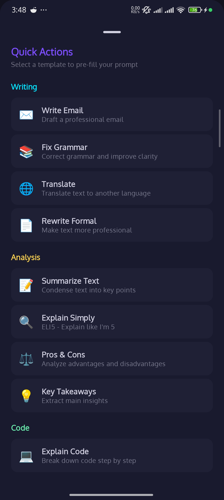
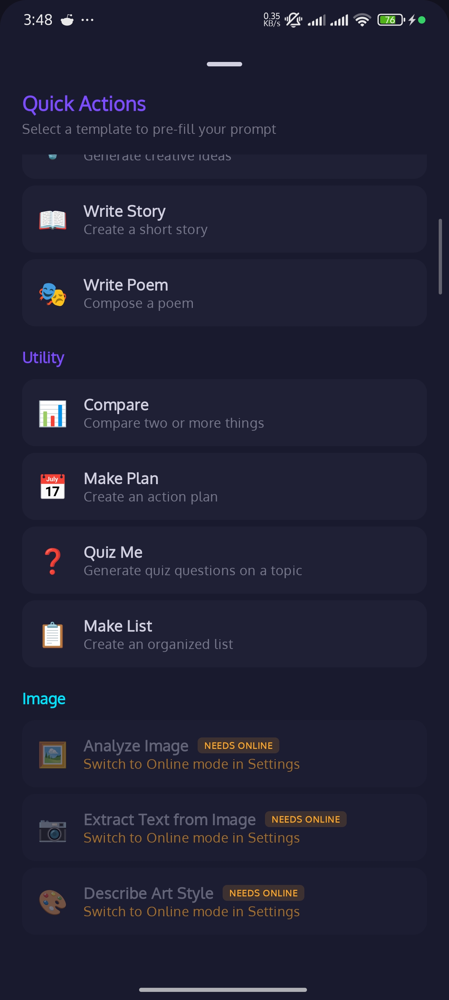

# 🧠 MEDHA — Neural Intelligence Engine

<p align="center">
  
  
  
  
  
  
</p>

<p align="center">
  <b>Your AI. Your Rules. Online or Offline — MEDHA thinks for you.</b><br/>
  <sub>A dual-engine AI assistant that runs Gemma 2B locally on your device OR connects to Gemini in the cloud. No compromises.</sub>
</p>

---

## 📸 Screenshots

<p align="center">
  
  
  
  
</p>
<p align="center">
  
  
  
  
</p>
<p align="center">
  
</p>

---

## ✨ Features

### 🔀 Dual Engine — Your Choice, Your Privacy
> One app. Two brains. Switch in one tap.
- 🔒 **Offline Mode** — Gemma 2B It GPU Int4 runs 100% on-device via MediaPipe. Zero internet. Zero data leaks.
- ☁️ **Online Mode** — Gemini 2.0 Flash / 1.5 Pro via Google AI API. Faster, smarter, multimodal.
- ⚡ **Seamless Switching** — Toggle between engines in Settings. Chat history preserved.

### 🎭 Grand Masters — AI Personas with Depth
> Not just prompts. Personalities.
- ♟️ **Chess Master** — Strategic analysis, opening theory, endgame puzzles
- 🏥 **Health Advisor** — Symptom analysis, wellness tips, medical info
- 💻 **Code Guru** — Debug, explain, refactor, architect
- 🎯 **Career Coach** — Resume tips, interview prep, growth strategy
- 🛡️ **Custom Personas** — Create your own Grand Master (e.g., Ethical Hacker!)
- 📤 **Import/Export** — Share your custom personas across devices

### ⚡ 22+ Quick Action Templates
> One tap. Instant AI magic.
- ✍️ **Writing** — Blog posts, emails, stories, social captions
- 📊 **Analysis** — Summarize, compare, explain, fact-check
- 💻 **Code** — Write, debug, convert, explain code
- 🔧 **Utility** — Translate, grammar fix, format data
- 🖼️ **Image** — Analyze photos, OCR text extraction, art style detection *(Online only)*

### 🔑 Smart API Key Management
> Enterprise-grade key rotation for a mobile app.
- 🔄 **Multi-Key Failover** — Add multiple Gemini API keys, auto-rotates on failure
- ✅ **Key Validation** — Real-time status check (Active/Invalid/Rate Limited)
- 📊 **Usage Tracking** — See which key is active, switch manually if needed
- 🔒 **Encrypted Storage** — Keys stored securely on device

### 📷 Multimodal Intelligence *(Online)*
> See what your AI sees.
- 📸 **Camera Input** — Snap a photo, ask anything about it
- 🖼️ **Image Analysis** — Describe, extract text, identify objects
- 🎨 **Art Recognition** — Identify art styles, techniques, compositions

### 💬 Chat Experience
> Conversations that feel alive.
- 🧠 **Context-Aware** — Remembers conversation history within sessions
- ⚙️ **Engine Status** — Always know which model is thinking
- 📋 **Copy/Share** — One-tap response actions
- 🎨 **Material 3 Design** — Beautiful, smooth, native Android feel

---

## 🏗️ Tech Stack

| Layer | Technology |
|-------|-----------|
| 🗣️ **Language** | Kotlin 100% |
| 🎨 **UI** | Jetpack Compose + Material 3 |
| 🏛️ **Architecture** | MVVM + Clean Architecture |
| 🧠 **On-Device AI** | Google MediaPipe + Gemma 2B It GPU Int4 |
| ☁️ **Cloud AI** | Google Generative AI SDK (Gemini) |
| 💉 **DI** | Koin |
| ⚡ **Async** | Kotlin Coroutines + Flow |
| 🗄️ **Storage** | Room Database + DataStore |
| 📱 **Min SDK** | 24 (Android 7.0) |
| 🎯 **Target SDK** | 35 (Android 15) |

---

## 🧬 Architecture

```
app/
 ui/
   home/            → 🏠 Main chat interface
   settings/        → ⚙️ Engine toggle, API keys
   grandmasters/    → 🎭 Persona management
   quickactions/    → ⚡ Template browser
   about/           → ℹ️ App info & version
 data/
   repository/      → 📂 Chat & settings repos
   model/           → 📄 Data models
   local/           → 💾 Room + DataStore
   remote/          → ☁️ Gemini API client
 domain/
   usecase/         → 🔄 Business logic
   engine/          → 🧠 AI engine abstraction
 di/                → 💉 Koin modules
 utils/             → 🔧 Extensions & helpers
```

---

## 🔥 Key Technical Highlights

- 🧠 **On-Device LLM Inference** — Gemma 2B runs entirely on-device using MediaPipe's GPU-accelerated Int4 quantization. No server. No latency. No privacy concerns.
- 🔄 **Dual Engine Abstraction** — Clean interface pattern lets the app seamlessly switch between local (MediaPipe) and cloud (Gemini) inference with zero UI changes.
- 🔑 **Multi-Key Failover System** — Automatic API key rotation with health checking. If one key hits rate limits, the next one kicks in instantly.
- 🎭 **Dynamic Persona Engine** — Grand Masters aren't just system prompts — they're exportable, importable JSON configs with custom personalities.
- 📷 **Multimodal Pipeline** — Camera → Bitmap → Base64 → Gemini Vision API, all within Compose lifecycle.
- ⚡ **Streaming Responses** — Real-time token streaming for both online and offline engines. No waiting for complete responses.

---

## 🚀 Quick Start

```bash
git clone https://github.com/ashokvarmamatta/MEDHA.git
```

1. Open in **Android Studio** (Hedgehog or later)
2. Sync Gradle
3. Run on device (API 24+)

> **Offline Mode**: Works immediately — Gemma 2B model downloads on first use (~1.5GB)
> **Online Mode**: Add your [Gemini API key](https://aistudio.google.com/apikey) in Settings

---

## 👨‍💻 Author

**Matta Ashok Varma** — Senior Android Developer

[](https://github.com/ashokvarmamatta)
[](https://www.linkedin.com/in/ashokvarmamatta)
[](https://ashokvarmamatta.github.io/portfolio/)
