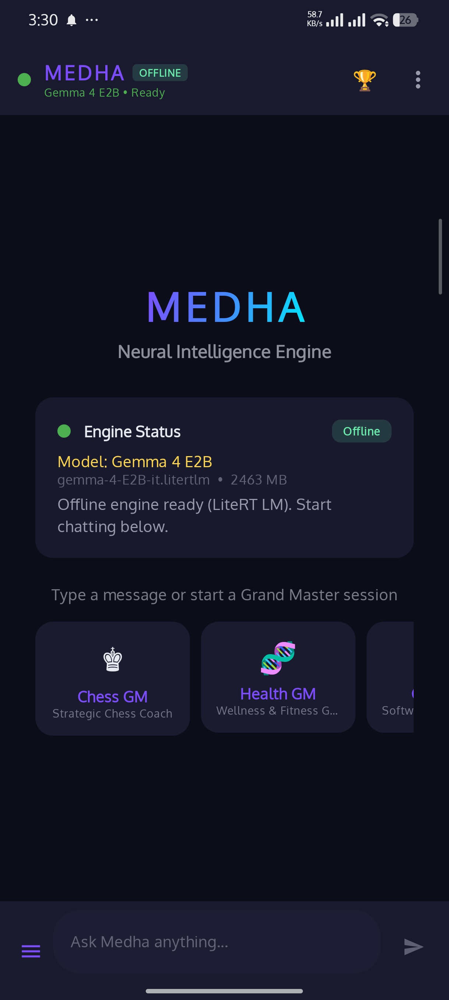
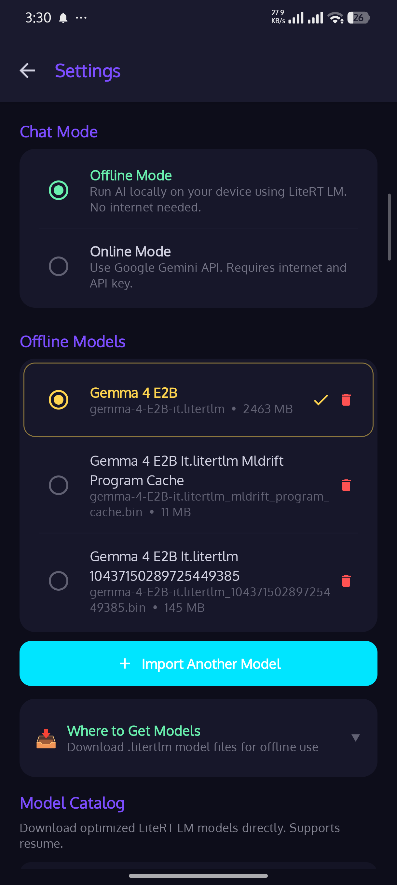
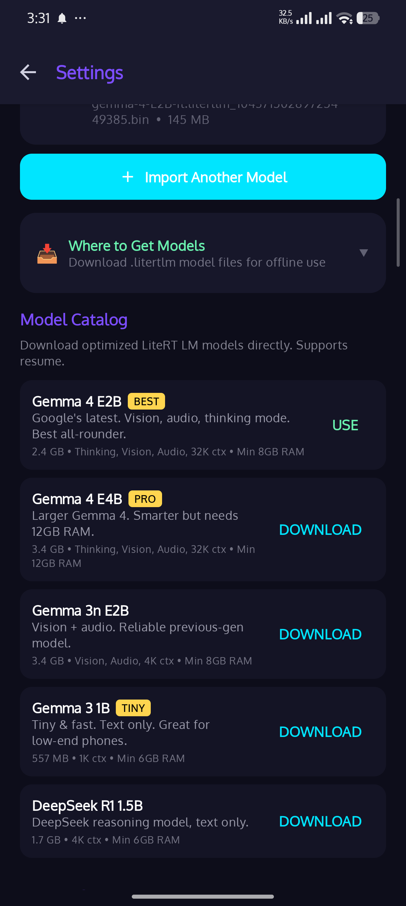
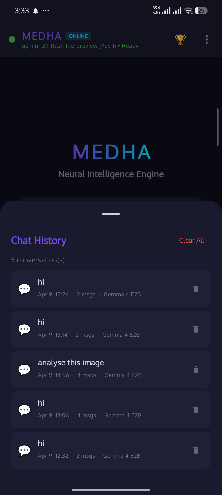
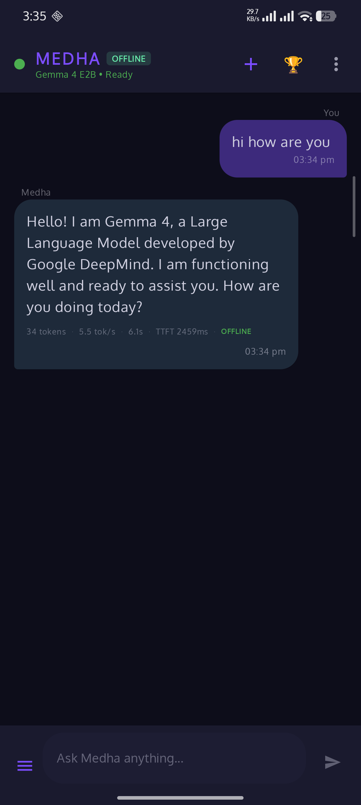
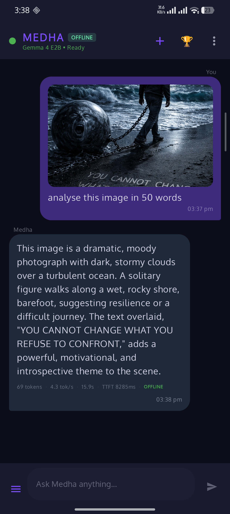
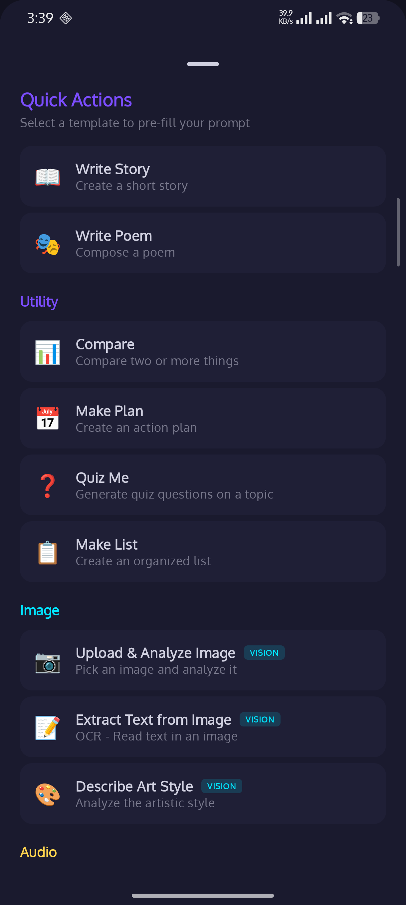

<div align="center">

# 🧠 MEDHA

### On-Device AI with Gemma 4 — Vision, Audio, Thinking. Nothing leaves your phone.


<br/>

[](https://developer.android.com)
[](https://kotlinlang.org)
[](https://developer.android.com/compose)
[](https://ai.google.dev/edge/litert)
[](#)
[](LICENSE)

</div>

---

## 🤔 Why This Project Exists

> **Can you run a real AI model — with vision and thinking — entirely on your phone?**
> Yes. MEDHA does exactly that.

Most AI apps are just API wrappers — they send your data to a cloud server and charge you for it. MEDHA takes a different approach. It runs Google's Gemma 4 model **directly on your Android phone** using the LiteRT LM SDK.

**There is no cloud path at all.** No accounts, no API keys, no inference endpoint. The only network request the app can make is downloading a model file from Hugging Face — after that you can turn the radio off for good. Privacy here is a property of the architecture, not a promise in a settings screen.

> This is an actively developed project with real features, real bugs, and real limitations.

---

## 📱 What is MEDHA?

**MEDHA** (Mobile Edge Device Hybrid AI) is an Android AI chat app that runs Gemma 4 on your phone. Ask it questions, analyze images, process audio — all without internet.

```
📱 You type / attach an image
    │
    ▼
🧠 Gemma 4 — LiteRT LM, on your phone
    ├── Text     : CPU (GPU opt-in)
    ├── Vision   : GPU, with CPU fallback
    └── Thinking : chain-of-thought, streamed
    │
    ▼
💬 Response — streamed token by token, with live tok/s
```

---

## 📸 Screenshots

| Home | Settings | Model Catalog |
|:---:|:---:|:---:|
| <a href="screenshots/01_home.png"></a> | <a href="screenshots/02_settings.png"></a> | <a href="screenshots/03_model_catalog.png"></a> |

| Chat History | Offline Chat | Image Analysis |
|:---:|:---:|:---:|
| <a href="screenshots/05_chat_history.png"></a> | <a href="screenshots/06_chat_offline.png"></a> | <a href="screenshots/07_image_analysis.png"></a> |

| Quick Actions |
|:---:|
| <a href="screenshots/08_quick_actions.png"></a> |

---

## 🧠 On-Device AI (Gemma 4 + LiteRT LM)  

| Feature | What it does |
|---------|-------------|
| 🔥 **Gemma 4 E2B / E4B** | Google's latest on-device model — vision, audio, thinking |
| 👁️ **On-Device Vision** | Analyze images, OCR, describe art — GPU vision encoder with CPU fallback |
| 🎤 **Audio Input** | Process audio files on-device with audio-capable models |
| 💭 **Thinking Mode** | Chain-of-thought reasoning — watch the model think in real-time |
| 🌐 **140+ Languages** | Pre-trained on 140+ languages, 35+ ready out-of-the-box |
| 🗣️ **Output Language Lock** | Pick from 45+ languages — AI replies ONLY in chosen language |
| ⚡ **Streaming** | Token-by-token display, with **live tokens/sec while generating** |
| 📊 **Token Stats** | Tokens, tok/s, latency, TTFT on every response |
| 🎛️ **Load / Unload** | Release the model's memory without killing the app |

### 📦 Model Catalog  

| Model | Size | Capabilities | Best For |
|-------|------|-------------|----------|
| 🥇 **Gemma 4 E2B** | 2.6 GB | Text + Vision + Audio + Thinking + 140 languages | Most phones (8GB+ RAM) |
| 🥈 **Gemma 4 E4B** | 3.7 GB | Text + Vision + Audio + Thinking + 140 languages | Flagship phones (12GB+ RAM) |
| 🥉 **Gemma 3n E2B** | 3.7 GB | Text + Vision + Audio | Previous gen, still solid |
| 🪶 **Gemma 3 1B** | 584 MB | Text only | Low-end phones (6GB RAM) |
| 🧪 **DeepSeek R1 1.5B** | 1.8 GB | Text + Reasoning | Reasoning tasks |

---

## 📂 Shared Model Folder 

A 2.4 GB model shouldn't be downloaded once per app. MEDHA can read models from a folder **you** pick — typically `/sdcard/AIModels` — so one copy serves every AI app on the device.

| Feature | What it does |
|---------|-------------|
| 📁 **Folder picker** | `ACTION_OPEN_DOCUMENT_TREE` — **no storage permission required** |
| 📄 **Single file** | Grant one `.litertlm` instead of a whole folder |
| 🔍 **Subfolder scan** | Finds models one level deep, skipping other apps' voice/speech packs |
| 📋 **Copy in** | Shared models are copied into app storage on first use — see note below |
| 💾 **Detected by presence** | A model copied from a PC is indistinguishable from a downloaded one |

> **Why the copy?** LiteRT LM opens the model by absolute path in native code. A SAF `content://` URI can't be passed, and neither can `/proc/self/fd/N` — that re-opens the file through the filesystem and fails a fresh permission check. The alternatives are all-files access (Play-restricted) or a one-time copy. MEDHA copies.

---

## ⚙️ Model Configurations 

| Setting | Range | What it controls |
|---------|-------|-----------------|
| 🎚️ **Max Tokens** | 256 — 8192 | Context window (capped by available RAM — see below) |
| 🎯 **TopK** | 1 — 128 | Number of top tokens to consider |
| 📊 **TopP** | 0.00 — 1.00 | Nucleus sampling threshold |
| 🌡️ **Temperature** | 0.00 — 2.00 | Creativity vs accuracy |
| 🖥️ **Accelerator** | CPU / GPU | CPU by default; GPU is opt-in |
| 💭 **Enable Thinking** | On / Off | Chain-of-thought mode |
| 🌐 **Output Language** | 45+ languages | Force AI to reply in a specific language |

> **Context is budgeted against real memory.** Gemma 4 advertises a 32K window, but its KV cache is allocated at first inference — asking for 32K on a 7 GB phone drove RSS to 7.2 GB and got the app killed by `lowmemorykiller`. MEDHA now sizes the window from free RAM (~190 KB/token, measured) and tells you what it picked.

---

## ⚡ Quick Actions 

<details>
<summary>Click to expand all 24 templates</summary>

| Category | Templates |
|----------|----------|
| ✍️ **Writing** | Write Email, Fix Grammar, Translate, Rewrite Formal |
| 📊 **Analysis** | Summarize, Explain Simply, Pros & Cons, Key Takeaways |
| 💻 **Code** | Write Code, Debug, Refactor, Explain Code |
| 🔧 **Utility** | Compare, Make Plan, Quiz Me, Make List |
| 👁️ **Image** | Upload & Analyze Image, Extract Text (OCR), Describe Art Style |
| 🎤 **Audio** | Upload & Transcribe Audio, Analyze Audio |

</details>

---

## 💬 Chat Experience 

| Feature | What it does |
|---------|-------------|
| 📜 **Chat History** | Room DB persistence — load, delete, clear sessions |
| 🔄 **Streaming Display** | Watch responses appear token by token |
| 💭 **Thinking Display** | See chain-of-thought in real-time (expandable) |
| 📊 **Performance Stats** | `113 tokens · 11.2 tok/s · 10.1s · TTFT 2340ms` |
| 🖐️ **Free scrolling** | Scroll up mid-stream and it stays put; return to the bottom and it follows again |
| 📋 **Copy / Regenerate** | Per-message actions on every reply |
| 🔔 **Background Service** | Foreground service keeps the model alive when the screen is off |

---

## 🚧 Work in Progress

| Component | Status | Notes |
|-----------|--------|-------|
| Offline Text Chat |  | Gemma 4 via LiteRT LM |
| On-Device Vision |  | GPU encoder, falls back to CPU |
| On-Device Audio |  | Audio backend configured, playback TBD |
| Thinking Mode |  | Chain-of-thought with streaming |
| Shared Model Folder |  | SAF picker, copy-in on first use |
| GPU Inference |  | Segfaults on some Adreno GPUs; guarded, defaults to CPU |
| Chat History |  | Room DB |

> ⚠️ Found a bug? [Open an issue](https://github.com/ashokvarmamatta/MEDHA/issues)

---

## 🏗️ Tech Stack

[](https://kotlinlang.org)
[](https://developer.android.com/compose)
[](https://ai.google.dev/edge/litert)
[](https://developer.android.com/training/data-storage/room)
[](https://insert-koin.io)

| Layer | Technology |
|-------|-----------|
| 🗣️ Language | Kotlin 2.2 |
| 🎨 UI | Jetpack Compose + Material 3 |
| 🏛️ Architecture | MVVM — `ViewModel` + `StateFlow<ChatState>` |
| 🧠 On-Device AI | LiteRT LM 0.16.0 (Gemma 4) |
| 💉 DI | Koin |
| ⚡ Async | Kotlin Coroutines + Flow |
| 🗄️ Storage | Room Database + DataStore Preferences |
| 🌐 Network | `HttpURLConnection` — model download only, no HTTP client library |
| 📱 Min SDK | 31 (Android 12) · **arm64-v8a only** |
| 🎯 Target SDK | 36 |

<details>
<summary>📂 Architecture</summary>

```
app/
 data/
   local/           → 💾 Room ChatDatabase, ModelStorage, ExternalModelStore, EnginePrefs
   repository/      → 📂 SettingsRepository (DataStore)
   ModelCatalog.kt  → 📦 Model catalog with download URLs
 domain/model/
   ChatState.kt     → 🔄 UI state
   Message.kt       → 💬 Chat message with token stats
   ModelInfo.kt     → 📄 Model metadata + capabilities
 presentation/screens/
   chat/            → 💬 Chat UI + streaming + history + config dialog
   settings/        → ⚙️ Model catalog, shared folder, load/unload
   about/           → ℹ️ App info
 ui/icons/          → 🎨 Hand-authored icons (drops material-icons-extended)
 service/
   MedhaService.kt  → 🔔 Foreground service for background inference
 di/
   AppModule.kt     → 💉 Koin DI
```

</details>

---

## 🔥 Key Technical Highlights

| Highlight | Details |
|-----------|---------|
| 🧠 **LiteRT LM Engine** | Streaming via `MessageCallback`; graceful fallback ladder GPU → CPU vision → CPU → text-only → smaller context |
| 👁️ **On-Device Vision** | Images downscaled to 512px PNG → `Content.ImageBytes` → Gemma 4 vision encoder |
| 💭 **Thinking Mode** | `enable_thinking` extra context. Thought stream via `message.channels["thought"]` |
| 🧮 **RAM-aware context** | KV cache budgeted from free memory instead of the model's advertised maximum |
| 🛡️ **GPU crash guard** | A GPU attempt is marked before load and cleared only after a generation succeeds, so a native segfault can't become a boot loop |
| 📥 **Resume Downloads** | HTTP Range requests; the server's `Content-Length` is authoritative, not the catalog |
| 📦 **39 MB APK** | Down from 156 MB — arm64-only, no `material-icons-extended`, no View-system libraries |

> ⚠️ **`visionBackend` is required for image input.** Without it in `EngineConfig`, `Content.ImageBytes` causes a native SIGSEGV. See [GEMMA4_GUIDE.md](GEMMA4_GUIDE.md).

---

## 🚀 Quick Start

```bash
git clone https://github.com/ashokvarmamatta/MEDHA.git
```

1. 📂 Open in **Android Studio** (Ladybug or later)
2. 🔄 Sync Gradle
3. 📱 Run on a **physical device** (Android 12+, 8GB+ RAM recommended)

> Builds target `arm64-v8a` only, so x86_64 emulators are not supported. Add `"x86_64"` to `abiFilters` in `app/build.gradle.kts` if you need one.

### 🔒 Get a model
1. **Settings → Model Catalog** → download **Gemma 4 E2B** (2.6 GB), **or**
2. **Settings → Shared model folder** → point it at a folder that already has a `.litertlm`

Then start chatting — no key, no account, no connection.

### 📖 Full Guide
See **[GEMMA4_GUIDE.md](GEMMA4_GUIDE.md)** — complete beginner's guide to running Gemma 4 on Android.

---

<div align="center">

### 👨‍💻 Built by Matta Ashok Varma

<p align="center">
<a href="https://github.com/ashokvarmamatta"></a>&nbsp;
<a href="https://www.linkedin.com/in/ashokvarmamatta"></a>&nbsp;
<a href="https://ashokvarmamatta.github.io/portfolio/"></a>
</p>

**🧠 MEDHA — Your AI. Your Device. Your Privacy.**

<sub>Built with Jetpack Compose, LiteRT LM & Gemma 4 by Google</sub>


</div>
